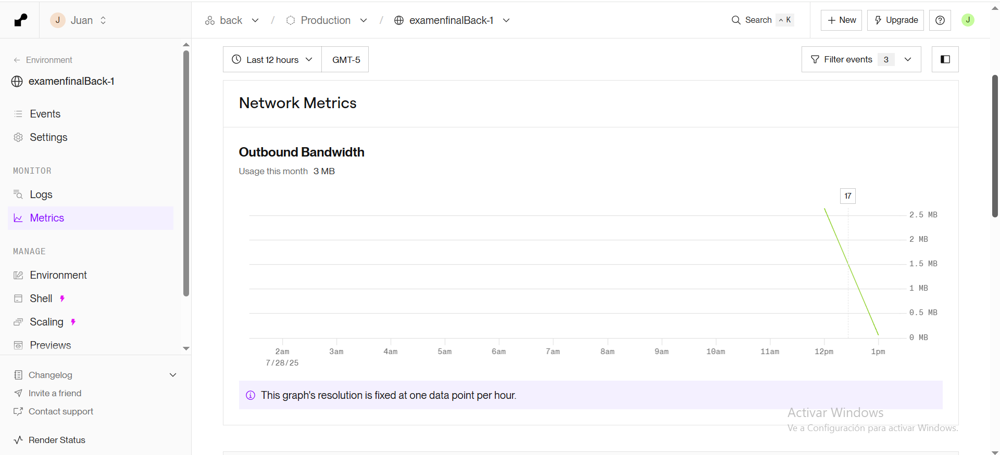
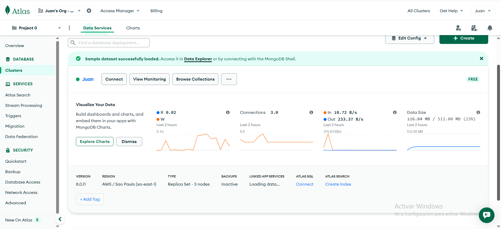

# Backend - Sistema de Gestión de Profesores

Este es el backend de la aplicación, desarrollado en Spring Boot y conectado a MongoDB Atlas.

## 🚀 Despliegue
- **Render:** [Enlace al backend desplegado](https://examenfinalback-1.onrender.com)

## 📦 Instalación local
1. Clona el repositorio:
   ```bash
   git clone https://github.com/Juan9811/examenfinalBack.git
   ```
2. Entra a la carpeta del backend:
   ```bash
   cd backend/profesor-backend
   ```
3. Configura las variables de entorno en `application.properties` para tu MongoDB Atlas.
4. Ejecuta la aplicación:
   ```bash
   ./mvnw spring-boot:run
   ```

## 🖥️ Capturas y monitoreo
- [Panel de Render]()
- [MongoDB Atlas]()

---
- [Repositorio Frontend](https://github.com/Juan9811/examenfinalFront)
